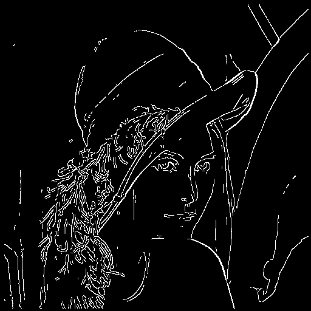

# Pynq-Z2-CannyEdgeDetection
An Implementation of Canny Edge Detection on Pynq-Z2

## Example

## Platform and Tools
**Pynq-Z2 Board**  
**Pynq-v2.5.4 Image**  
**Vivado/Vivado HLS v2019.1**  

## References
[Xilinx PYNQ-HelloWorld](https://github.com/Xilinx/PYNQ-HelloWorld)  
[HLS-canny-edge-detection](https://github.com/medalotte/HLS-canny-edge-detection)

## License
**PYNQ** License : [BSD 3-Clause License](https://github.com/Xilinx/PYNQ/blob/master/LICENSE)
